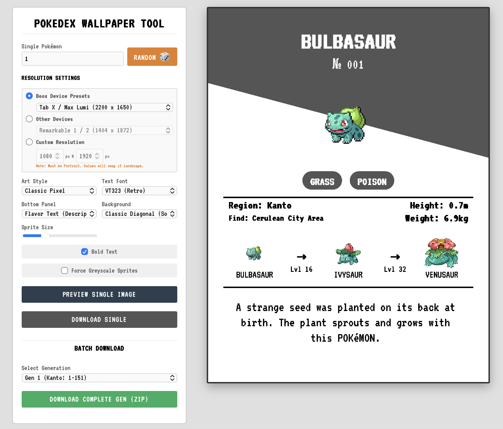

# Xteink Boox Ultimate Wallpaper Tool

A lightweight, client-side web tool designed to generate optimized lock screen wallpapers for E-Ink tablets (Boox, Remarkable, Kindle, Kobo, etc.) using dynamic data from the [PokéAPI](https://pokeapi.co/).

## 🚀 Features

### Core Functionality
* **Client-Side Generation:** Runs entirely in the browser using HTML5 Canvas. No backend server required; no user data is stored.
* **Dynamic Data:** Fetches sprites, evolution chains, physical stats, and Pokedex entries dynamically.
* **Smart Layout:** Automatically adjusts layout geometry based on screen size to ensure perfect alignment of sprites, text, and divider lines.

### 📱 Device Support
Includes pre-configured resolution presets for major E-Ink devices:

* **Onyx Boox:**
    * 13.3": Tab X, Max Lumi (2200x1650)
    * 10.3": Tab Ultra C, Note Air 3C, Note Air 1/2, Go 10.3 (2480x1860 / 1872x1404)
    * 7.8": Tab Mini C, Nova Air (1404x1872)
    * 7": Page, Leaf 2, Galileo (1264x1680)
    * 6": Palma, Poke 5/4/3 (824x1648 / 1072x1448)
* **Remarkable:** Remarkable 1 & 2, Paper Pro, Paper Pro Move.
* **Kindle:** Scribe, Paperwhite (11th Gen), Basic (2022).
* **Kobo:** Libra Colour, Sage, Elipsa 2E, Clara Colour.
* **XTEink:** X4 (Special support).

### 🎨 Customization
* **Art Styles:** Switch between Classic Pixel, Official Artwork, Dream World, and Home 3D Renders.
* **Fonts:** Toggle between **VT323** (Retro), **Pixelify Sans** (Clean), and **Courier New**.
* **Info Panel:** Choose to display **Flavor Text** (Pokedex description) or **Base Stats** (HP/ATK/DEF/SPD bars).
* **Backgrounds:** Dynamic Type Color, Classic Diagonal (Soft Grey), Solid White, or Solid Black.
* **Grayscale Mode:** "Force Greyscale" option to preview contrast on E-Ink screens.

### 💾 Export Options
* **PNG Export:** Standard export for most devices.
* **Native BMP Support:** When **XTEink X4** is selected, the tool automatically encodes and downloads a `.bmp` file (required by that specific hardware) instead of PNG.
* **Batch Processing:** Generate and download entire generations (Gen 1-9) as a single `.zip` file.

---

## 🛠️ How to Use

### 1. Running the Tool
Because this is a single HTML file with no build step, you can run it in two ways:
* **Online:** [Click here for the live demo](https://m86-tech.github.io/BOOX-Pokedex-Wallpaper-Generator/) 
* **Locally:** Simply download `index.html` and double-click it to open in Chrome, Firefox, or Safari.

### 2. Generating a Wallpaper
1.  **Select Device:** Choose your device from the dropdown menu. If your device isn't listed, select "Custom Resolution" and enter the dimensions manually.
2.  **Choose Pokémon:** Enter a name (e.g., "Gengar"), an ID number (e.g., "94"), or click **Random 🎲**.
3.  **Customize:** Adjust the art style, font, and background settings to your liking.
4.  **Download:** Click **"Download Single"** to save the current image.

### 3. Batch Downloading
1.  Select a Generation range from the "Batch Download" dropdown (e.g., "Gen 1 (Kanto)").
2.  Click **"Download Complete Gen (ZIP)"**.
3.  Wait for the progress bar to finish. The tool will generate images for every Pokémon in that generation and prompt a ZIP download.

---

## 🔧 Technical Details

* **Frameworks:** Vanilla JavaScript, HTML5, CSS3.
* **Libraries:**
    * [`JSZip`](https://stuk.github.io/jszip/): For creating ZIP archives client-side.
    * [`FileSaver.js`](https://github.com/eligrey/FileSaver.js/): For reliable file saving across browsers.
* **API:** [PokéAPI](https://pokeapi.co/) (RESTful API).

### Smart Layout Engine
The tool uses a relative spacing unit (`s`) derived from the canvas resolution. This ensures that margins, font sizes, and image positions remain proportional whether you are generating an image for a tiny 6-inch screen or a massive 13.3-inch tablet.

## 📄 Credits & License
Code: MIT License. Free to fork and modify.

Data & Assets: Pokémon content and materials are trademarks and copyrights of Nintendo, Creatures Inc., and GAME FREAK inc. This tool is fan-made and not affiliated with Nintendo.

Fonts: Google Fonts (VT323, Pixelify Sans).
